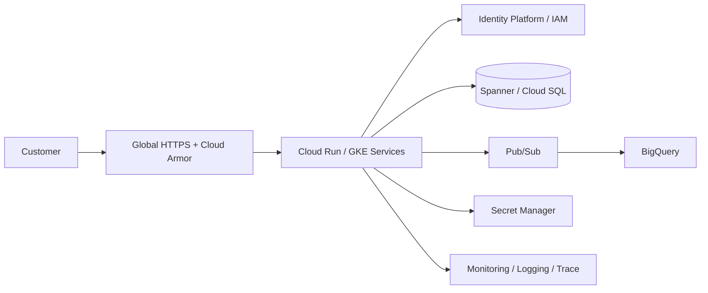

# SecureBank Online Banking Portal


## Executive summary

SecureBank is an end-to-end portfolio case study for designing a secure, resilient digital banking platform on Google Cloud. It demonstrates the connection between business requirements, cloud architecture, application delivery, infrastructure as code, DevSecOps, reliability, disaster recovery and technical project management.

> **Important:** This is a portfolio demonstration. It does not process real banking credentials, customer data, card data or funds, and it is not a production banking deployment or regulatory certification.

## Business problem

A modern banking portal must provide fast customer journeys while protecting sensitive information, maintaining transaction integrity, surviving infrastructure failures and giving operations teams measurable reliability signals.

## Solution



## Implemented vs blueprint

| Area | Status |
|---|---|
| Synthetic banking dashboard | **Implemented demo** |
| Account/transaction APIs | **Implemented demo** |
| Transfer validation | **Implemented simulation** |
| Automated API tests | **Implemented** |
| GitHub Actions security/CI | **Implemented workflow** |
| Architecture diagrams/ADRs | **Implemented documentation** |
| Terraform | **Parameterized blueprint** |
| Cloud Run/GKE production deployment | **Blueprint** |
| Production identity/database | **Blueprint** |
| Multi-region failover | **Design + test procedure** |
| Real banking integrations | **Out of scope** |

## Technology stack

**Cloud:** Google Cloud, Cloud Run/GKE, HTTPS Load Balancing, Cloud Armor, Spanner/Cloud SQL, Pub/Sub, BigQuery, Secret Manager, Cloud Monitoring.

**Engineering:** Node.js, REST/OpenAPI, HTML/CSS/JavaScript, Terraform, GitHub Actions.

**Delivery:** Agile delivery controls, RAID/risk management, WBS, roadmap, change control, acceptance criteria and operational readiness.

## Run the demo

```bash
cd app
npm test
npm start
```

Then open `http://localhost:8080`.

The transfer workflow is intentionally simulated and returns `SIMULATED`; no funds are moved.

## Repository map

### Architecture
- `architecture/diagrams/` — high-level, network, data, security and DR views
- `architecture/decisions/` — architecture decision records

### Infrastructure
- `infrastructure/terraform/` — parameterized GCP blueprint

### Application
- `app/server.js` — demo API
- `app/public/index.html` — responsive dashboard
- `tests/server.test.js` — automated API tests

### DevSecOps
- `.github/workflows/securebank-ci.yml` — tests and dependency validation
- `.github/workflows/security.yml` — security checks
- `SECURITY.md` — security baseline and reporting guidance

### Project management
- `docs/project-management/` — charter, business case, scope, WBS, roadmap, stakeholders, RAID, risks, communications, change control and acceptance criteria

### Operations
- `docs/operations/` — deployment, incident response, backup/restore and DR testing

### Portfolio
- `docs/portfolio/` — outcomes, evidence guidance and demonstrated competencies

## Architecture principles

1. Security by design and least privilege.
2. Transactional and analytical workloads remain separated.
3. Asynchronous work uses event-driven integration.
4. Production secrets are managed outside source control.
5. Critical recovery paths have explicit RPO/RTO targets and tests.
6. Infrastructure is repeatable and parameterized.
7. Every material technical decision is traceable through an ADR.

## Project management approach

The delivery story follows a gated lifecycle: **Discover → Architect → Build → Assure → Release Readiness → Close/Learn**. Risks, stakeholders, scope changes and acceptance criteria are maintained alongside engineering artifacts so technical delivery remains tied to business outcomes.

## Portfolio competencies

This project demonstrates Cloud/Solutions Architecture, GCP service selection, network/data/security design, DevSecOps, infrastructure as code, testing, reliability engineering, disaster recovery planning and technical project management.

See `docs/portfolio/competencies.md` for the detailed mapping.

## Future production hardening

Before production, the platform would require approved identity and authorization models, data classification and residency decisions, regulatory/compliance assessment, production database sizing, WAF rules, private connectivity, centralized audit strategy, formal threat modelling, penetration testing, key management, budget controls, SLO ownership and executed DR exercises.

## Author / portfolio

**Abiodun Bolarinwa** — Cloud / IT Project Management portfolio case study.

GitHub: `github.com/Bolarinwaab`

---

**License:** See `LICENSE`.
