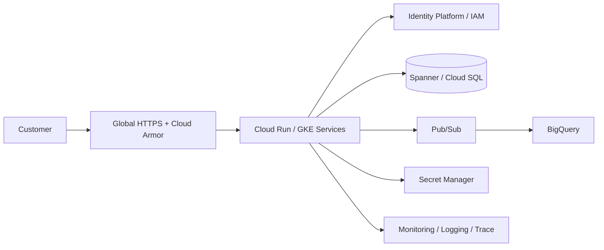

# SecureBank Online Banking Portal


## Executive summary

SecureBank is a functional portfolio implementation of a Nigerian digital-banking platform. It demonstrates customer authentication, NGN accounts, balances, transaction history, beneficiary verification, intra-bank and inter-bank transfers, transfer limits, authorization, fees, reversals, bill-payment simulation, audit events and operations reporting, alongside the existing Google Cloud architecture and technical project-management package.

> **Important:** This is an independently implemented portfolio sandbox using synthetic data. It is not an Access Bank product, does not connect to Access Bank or any other bank, does not process real money, and is not a production banking or regulatory-certified system.

## Access Bank-informed business context

The product journeys are informed by publicly documented Access Bank online-banking capabilities: accounts, transaction history, beneficiaries, transfers to other banks, bills, statements and token-based transaction authorization. Public Access Bank material also describes beneficiary name enquiry and reversal handling for failed electronic transfers. These public references are used only as product requirements context; no confidential/internal Access Bank material is reproduced.

## Functional banking experience

```text
Login → Session → Accounts → Beneficiary verification → Transfer review
                                      ↓
                              Authorization / OTP
                                      ↓
                      Validation → Debit → Reference
                                      ↓
                         Credit / external simulation
                                      ↓
                    Audit → Notification → Transaction history
```

### Customer features

- Secure demo session authentication
- Customer profile and MFA status
- NGN savings and current accounts
- Available and ledger balances
- Transaction history
- Beneficiary/name-enquiry simulation
- Intra-bank transfers with source debit and destination credit
- Inter-bank transfer simulation with fee and reference
- Daily transfer limit and insufficient-funds controls
- Failed-transfer reversal simulation
- Bill-payment simulation
- Notifications
- Responsive banking dashboard

### Operations features

- Transaction/audit events
- Operational summary endpoint
- Synthetic transaction references
- Failure and reversal scenarios
- Clear separation between customer experience and production integration blueprint

## Architecture



## Implemented vs blueprint

| Area | Status |
|---|---|
| Nigerian digital banking UI | **Implemented sandbox** |
| Authentication/session | **Implemented sandbox** |
| Accounts/balances | **Implemented sandbox** |
| Beneficiary verification | **Implemented simulation** |
| Intra/inter-bank transfers | **Implemented simulation** |
| Fees/limits/reversals | **Implemented domain logic** |
| Bill payments | **Implemented simulation** |
| Audit/operations APIs | **Implemented sandbox** |
| Automated banking domain tests | **Implemented** |
| GitHub Actions security/CI | **Implemented workflow** |
| Architecture diagrams/ADRs | **Implemented documentation** |
| Terraform | **Parameterized blueprint** |
| Cloud Run/GKE production deployment | **Blueprint** |
| Production identity/database | **Blueprint** |
| Multi-region failover | **Design + test procedure** |
| Real banking integrations | **Out of scope** |

## Run the application

```bash
cd app
npm ci
npm test
npm run check
npm start
```

Open `http://localhost:8080`.

Demo credentials are documented in `app/README.md` and are intended only for this local portfolio sandbox.

## Repository map

### Architecture
- `architecture/diagrams/` — high-level, network, data, security and DR views
- `architecture/decisions/` — architecture decision records

### Infrastructure
- `infrastructure/terraform/` — parameterized GCP blueprint

### Application
- `app/server.js` — HTTP API and session layer
- `app/src/banking.js` — banking transaction domain engine
- `app/src/banking.test.js` — banking domain tests
- `app/public/index.html` — responsive customer dashboard

### Delivery
- `.github/workflows/` — CI/security automation
- `docs/project-management/` — charter, business case, WBS, roadmap, RAID, risks, communications and change control
- `docs/operations/` — deployment, incident, backup/restore and DR procedures
- `docs/portfolio/` — outcomes, competencies and screenshot guidance

## Professional positioning

This project demonstrates the combined perspective of a **Cloud Architect and Technical Project Manager**: translating banking business journeys into architecture, APIs, security controls, reliability objectives, delivery governance and an executable software demonstration.

## Data and security boundary

All customer names, account numbers, balances, credentials and transactions are synthetic. Do not enter real banking information. Production implementation would require regulated-bank sponsorship, approved payment-network integrations, strong customer authentication, HSM/token controls, KYC/AML processes, fraud controls, privacy controls, penetration testing, independent security review, reconciliation and applicable Nigerian regulatory compliance.

## License

See `LICENSE`.
