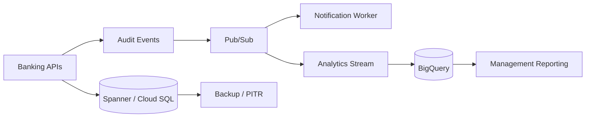

# Data Architecture

## Data domains

- **Customer/account domain:** identity references, account metadata and balances.
- **Transaction domain:** immutable transaction records, references and status.
- **Event domain:** asynchronous business and audit events.
- **Analytics domain:** curated BigQuery datasets for reporting and trend analysis.
- **Backup domain:** point-in-time and scheduled recovery artifacts.

Production implementation should apply encryption at rest/in transit, retention rules, access boundaries, data classification and appropriate regulatory controls.
