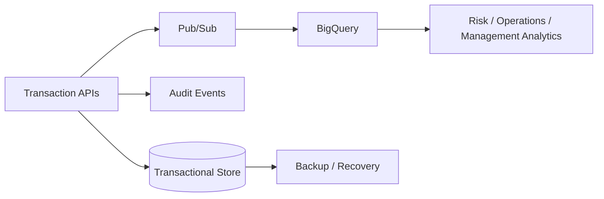

# Data Architecture

## Data zones

| Zone | Purpose | Security posture |
|---|---|---|
| Transactional | Accounts, balances and transaction records | Private, encrypted, least privilege |
| Event | Immutable business/audit events | Restricted producers/consumers |
| Analytical | Aggregated reporting and operational analytics | Separate workload from transactions |
| Secrets | Credentials and service configuration | Secret Manager; never source-controlled |

Production data classification should identify PII, financial records, audit records and operational telemetry before retention policies are approved.
