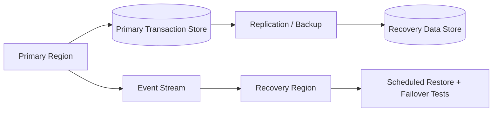

# Disaster Recovery Architecture

## Recovery objectives

| Capability | Target RTO | Target RPO | Strategy |
|---|---:|---:|---|
| Authentication | 60 min | 15 min | Managed identity + regional service recovery |
| Account access | 30 min | 5 min | Replicated critical data |
| Transfers | 30 min | 5 min | Transaction integrity + replay-safe events |
| Analytics | 4 hr | 1 hr | Rebuild from event/analytical stores |

These are portfolio planning targets, not contractual production commitments. Final values must be agreed with business owners, risk, compliance and operations.

## Recovery sequence

1. Declare incident and establish incident commander.
2. Protect data integrity and stop unsafe write paths if necessary.
3. Assess primary-region health and replication state.
4. Promote or restore the recovery environment.
5. Validate application health, data consistency and critical transactions.
6. Redirect traffic after acceptance checks.
7. Monitor stability and communicate status.
8. Conduct a post-incident review and capture recovery evidence.
