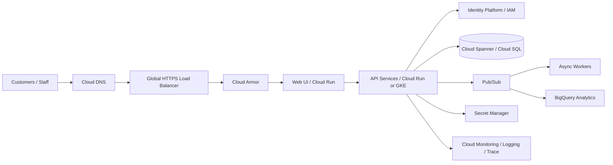

# SecureBank High-Level Architecture

## Design intent

SecureBank uses a layered edge-to-data model. Public traffic terminates at the managed HTTPS edge, Cloud Armor provides application-layer protection, and application services run without direct public database access. Transactional data is isolated from analytical workloads. Pub/Sub decouples notifications, audit/event processing and analytics from synchronous transaction paths.

## Reliability model

For production, deploy services across zones and use a multi-region strategy for critical data. Define RPO/RTO by business capability, test failover, and make recovery evidence part of release governance.

## Portfolio status

**Implemented:** synthetic-data demo application and documentation.

**Blueprint:** managed Google Cloud resources, production identity, transactional database, edge configuration, multi-region failover and production observability.
