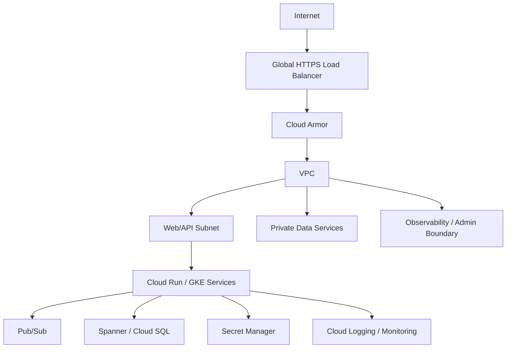

# Network Topology

## Segmentation

- Edge traffic is limited to HTTPS.
- Application workloads use managed identities rather than embedded credentials.
- Database services are private and are not exposed directly to the Internet.
- Administrative access is separated from customer traffic and governed by IAM.
- Egress is restricted according to service requirements; production deployments should use explicit firewall and service-control policies.

## Addressing principle

Use non-overlapping RFC1918 ranges selected per environment. The repository intentionally does not prescribe a production CIDR because it depends on enterprise connectivity, peering, VPN and existing network allocations.
