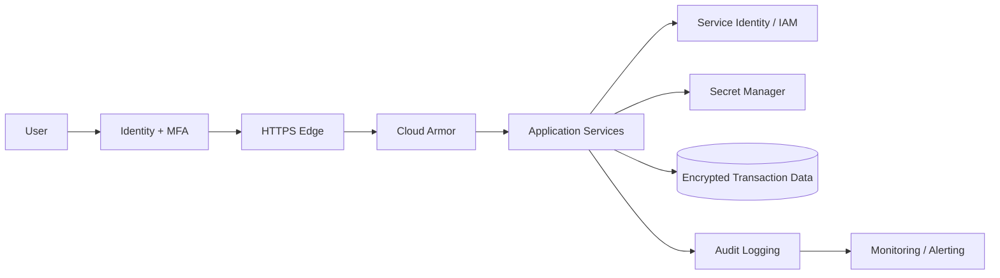

# Security Architecture

## Controls

1. Identity is separated from application authorization.
2. Service-to-service access uses workload identities and least privilege.
3. Secrets are stored in Secret Manager rather than environment files committed to Git.
4. TLS protects data in transit; managed encryption protects data at rest.
5. Cloud Armor protects the public edge.
6. Audit logs support investigation and compliance evidence.
7. CI performs dependency/security validation before merge.
8. Production releases require approval gates and rollback capability.

The demo contains no real customer authentication or banking credentials.
