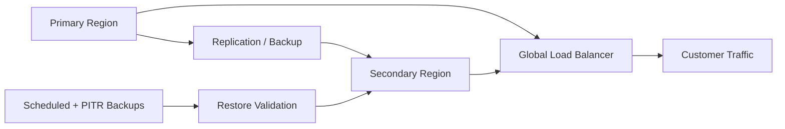

# Disaster Recovery Architecture

## Recovery model

| Area | Target approach |
|---|---|
| Application | Stateless multi-zone deployment with warm secondary region |
| Transaction data | Managed database replication/backups appropriate to approved consistency model |
| Events | Durable Pub/Sub topics/subscriptions and replay strategy |
| Secrets/config | Versioned managed secrets/configuration with controlled access |
| RTO | Target ≤ 60 minutes for regional failure; validate before production |
| RPO | Target ≤ 15 minutes for critical transaction data; validate before production |

## Failover sequence

1. Detect regional degradation through SLO/health signals.
2. Declare incident and assign incident commander.
3. Validate secondary-region health and data freshness.
4. Shift edge traffic using the approved load-balancing/failover mechanism.
5. Validate authentication, account and transaction journeys.
6. Monitor error rate, latency and backlog until stable.
7. Preserve evidence and perform post-incident review.

RTO/RPO values are portfolio targets, not claims of an already-tested production environment.
