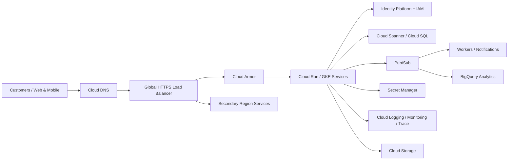

# High-Level Google Cloud Architecture

## Design principles

- Global HTTPS edge terminates and protects customer traffic.
- Cloud Armor provides WAF/DDoS policy enforcement at the edge.
- Stateless application services can scale horizontally.
- Transactional data is separated from analytics workloads.
- Pub/Sub decouples notifications, audit/event processing and analytics ingestion.
- Secrets are retrieved from Secret Manager rather than source control.
- Monitoring, logs and traces provide operational evidence.
- Secondary-region capacity supports continuity and controlled failover.
