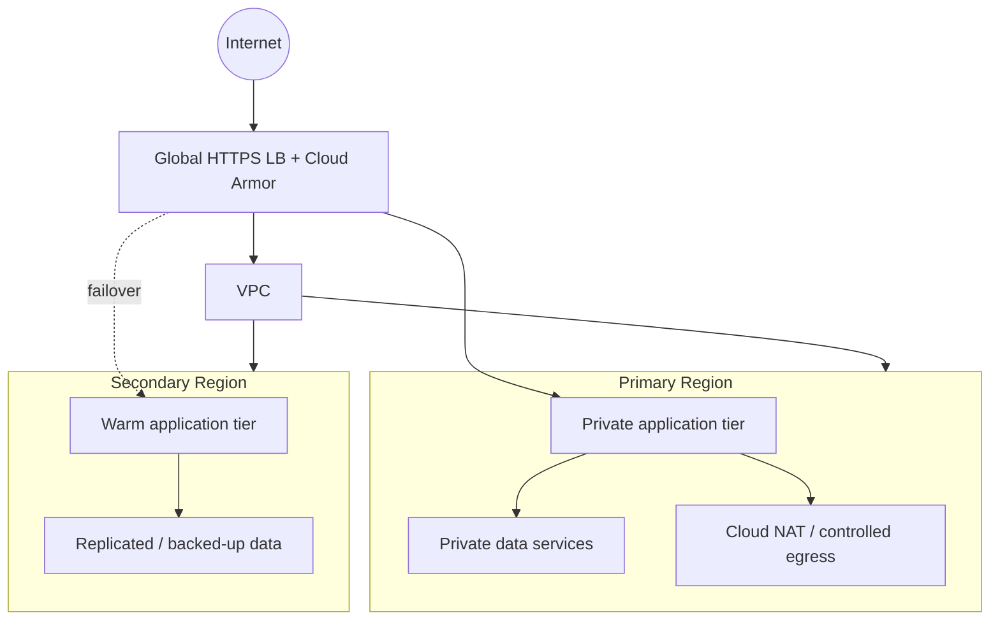

# Network Topology

## Controls

- No database should be directly reachable from the public internet.
- Private Google access is enabled for workloads that need Google APIs.
- Egress is controlled through NAT and explicit firewall policies.
- Administrative access uses identity-aware, auditable paths rather than exposed SSH.
- Region boundaries are treated as failure domains.
