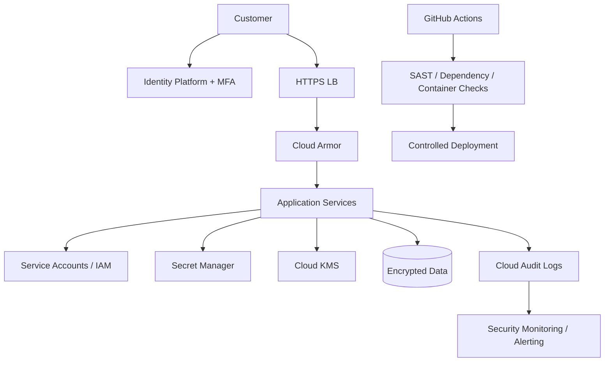

# Security Architecture

## Security layers

1. Identity: MFA, strong authentication and service identities.
2. Edge: TLS, Cloud Armor and rate/WAF policies.
3. Workload: least-privilege service accounts and hardened containers.
4. Secrets: Secret Manager/KMS; no credentials in source control.
5. Data: encryption, access boundaries, retention and auditability.
6. Supply chain: dependency review, automated tests and image scanning.
7. Detection: audit logs, monitoring, alerts and incident response.
