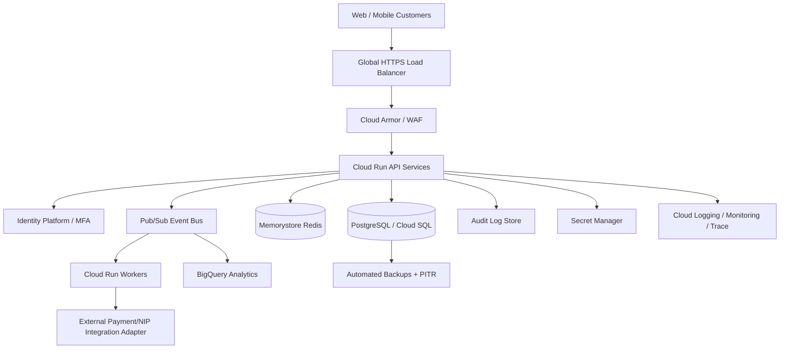

# SecureBank Production Architecture

## Target state

SecureBank is structured as a production-architecture reference implementation for a Nigerian digital bank. The deployed system remains a portfolio sandbox and must use synthetic data.



## Core production principles

1. **Ledger first:** financial state is represented by immutable ledger entries; account balances are derived and controlled with database transactions.
2. **Idempotency:** every money-moving command requires an idempotency key so retries cannot create duplicate transfers.
3. **Authorization:** customer resources are scoped to the authenticated customer; operations functions use explicit RBAC and maker/checker controls.
4. **Event-driven integration:** asynchronous notifications, analytics and external payment adapters are separated from the core transaction commit.
5. **Least privilege:** services receive only the IAM permissions they need. Secrets live in Secret Manager rather than source control.
6. **Observability:** every financial request carries a correlation ID and produces structured audit/security events.
7. **Resilience:** database backups, point-in-time recovery, queue retry/dead-letter patterns and regional recovery procedures are defined before production release.
8. **Secure edge:** WAF/DDoS controls protect internet-facing workloads. Cloud Armor is designed to mitigate application attacks including XSS and SQL injection. citeturn0search8

## Banking transaction lifecycle

```text
REQUEST
  -> authenticate
  -> authorize account ownership
  -> validate beneficiary
  -> validate amount/limits
  -> reserve/check available balance
  -> persist transfer + ledger entries atomically
  -> publish TransferCommitted event
  -> notify customer
  -> reconcile with external payment rail
  -> complete OR compensate/reverse
```

The external rail adapter is deliberately isolated. A production deployment would replace the adapter with an approved, contract-tested integration to the relevant Nigerian payment infrastructure; this portfolio project does not connect to live banking rails.

## Data consistency

Money movement must use a single database transaction for the internal ledger. The service should lock the affected account rows, verify the expected version/balance, write debit and credit entries, update balances, and commit together. Optimistic versioning prevents lost updates.

The `database/migrations/001_initial_banking_schema.sql` schema includes `version`, immutable `ledger_entries`, unique transfer references and unique idempotency keys.

## Cloud deployment model

Google Cloud documents Cloud Run integrations with Cloud SQL, Secret Manager, Pub/Sub, Cloud Tasks, Identity Platform, Cloud Armor, Artifact Registry and Cloud Observability. citeturn0search7 For this project, Cloud SQL PostgreSQL is the relational system of record, while Pub/Sub handles non-blocking events and Cloud Run provides independently deployable API/worker services.

Secrets are supplied through Secret Manager rather than committed configuration; Google specifically recommends Secret Manager for sensitive connection credentials. citeturn0search5turn0search13

## Security baseline

The API design is reviewed against OWASP API Security Top 10 concerns such as broken object-level authorization, broken authentication, unrestricted resource consumption, broken function-level authorization and sensitive business-flow abuse. citeturn0search0turn0search1

Production release gates should include dependency/SCA scanning, SAST, secret scanning, container scanning, infrastructure validation, API authorization tests and DAST against a non-production environment.

## Production readiness boundary

**Implemented in repository:** domain transaction engine, PostgreSQL schema, synthetic seed data, idempotency model, ledger model, Docker local stack, architecture and operational documentation.

**Still requiring real enterprise integration:** regulated identity/KYC, real MFA provider, HSM/key management, NIBSS/payment-rail connectivity, sanctions/AML provider, card processor, production observability tenancy, formal penetration testing, regulatory approvals and live customer onboarding.
